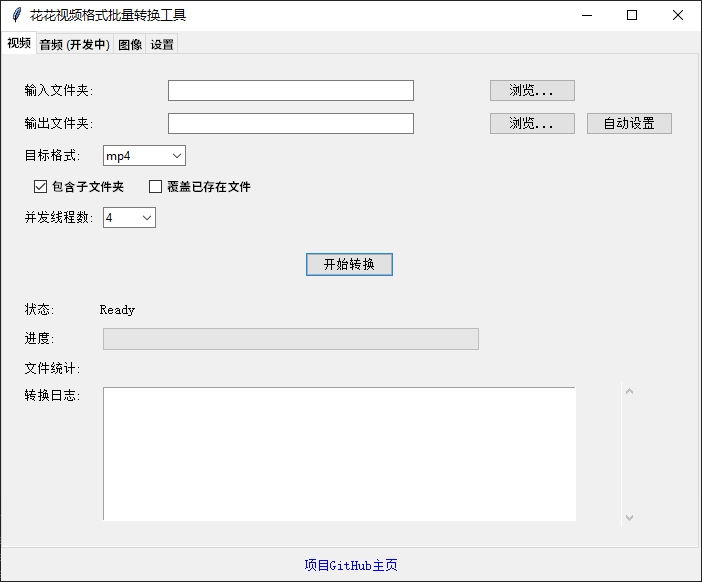

# 批量视频格式转换器

一款用户友好的图形用户界面 (GUI) 应用程序，使用 FFmpeg 批量转换不同格式的视频文件。

## 下载
最新版本，支持 Windows x86 系统。您可以直接从官方发布页面下载编译文件：[Free-Media-Conversion 官方发布](https://github.com/Berry-Wahlberg/Free-Media-Conversion/releases)

### 下载说明
1. 点击上方的官方发布页面链接，导航至 GitHub 发布页面。
2. 找到您所需的版本，并展开其 **Assets** 部分。
3. 点击相应的文件开始下载。
4. 下载完成后，解压压缩文件的内容。运行可执行文件（通常为 `.exe` 格式）即可启动应用程序。

## 功能特点

- 批量转换大量视频文件
- 支持多种视频格式（MP4、MKV、AVI、MOV、FLV、WMV等）
- 转换过程中保持文件夹结构
- 递归扫描子文件夹
- 可调整并发转换线程数量
- 进度跟踪和详细的转换日志
- 自动输出文件夹设置
- 支持中英文界面

## 环境要求

- Python 3.6及以上版本
- FFmpeg（必须放在`bin`目录下，命名为`ffmpeg.exe`）
- 所需Python包：
  - `tkinter`（通常随Python一起安装）
  - `subprocess`
  - `threading`
  - `queue`
  - `time`
  - `concurrent.futures`
  - `webbrowser`
  - `pyinstaller`（用于编译）

## 安装步骤

1. 克隆仓库或下载源代码
2. 在项目根目录创建`bin`文件夹
3. 下载适合您系统的FFmpeg二进制文件：
   - [FFmpeg Windows 版本](https://ffmpeg.zeranoe.com/builds/)
4. 将`ffmpeg.exe`放入`bin`目录
5. 安装所需的包：
   ```bash
   pip install pyinstaller
   ```
6. 运行应用程序：
   ```bash
   python main.py
   ```

## 编译为EXE文件

要将应用程序编译为独立的可执行文件，请按照以下步骤操作：

### 1. 环境设置

确保已安装所有必需的包，特别是`pyinstaller`：
```bash
pip install pyinstaller
```

### 2. 项目结构检查

确保您的项目结构正确：
```
video-converter/
├── main.py
├── bin/
│   └── ffmpeg.exe  # FFmpeg可执行文件
└── ...
```

### 3. 创建.spec文件（可选）

生成.spec文件以配置编译选项：

```bash
pyinstaller --name "VideoConverter" --onefile --windowed --add-data "bin\*;bin" --add-data "locales\*;locales" main.py
```

或使用更详细的配置：

```bash
pyinstaller --clean --onefile --windowed \
  --hidden-import=tkinter \
  --target-arch=x86_64 \
  --distpath=dist/windows \
  main.py
```

此命令将创建一个`VideoConverter.spec`文件。您可以编辑此文件以进一步自定义编译选项。

### 4. 使用.spec文件编译

运行以下命令使用.spec文件编译应用程序：
```bash
pyinstaller VideoConverter.spec
```

### 5. 验证编译的可执行文件

编译完成后，可执行文件将位于`dist`目录中。确保`bin`目录已正确包含，并且应用程序能够正常运行。

### 6. 常见问题

- **缺少FFmpeg**：确保`ffmpeg.exe`在`bin`目录中并已包含在编译中。
- **GUI显示问题**：如果GUI显示不正确，尝试在pyinstaller命令中添加`--hidden-import tkinter`。
- **文件体积过大**：编译后的可执行文件可能较大。您可以尝试使用UPX压缩或创建仅包含必要依赖项的虚拟环境。

## 使用方法

1. 启动应用程序
2. 选择包含视频文件的输入文件夹
3. 选择输出文件夹或使用自动设置
4. 选择目标视频格式（默认为MP4）
5. 配置选项：
   - 包含子文件夹以进行递归转换
   - 覆盖输出文件夹中的现有文件
   - 设置并发转换线程的数量
6. 点击"开始转换"开始处理
7. 监控转换进度和日志

## 截图



## 语言切换

该应用程序支持中英文两种语言。切换语言方法：
1. 找到界面底部的语言选择下拉菜单
2. 选择"zh"为中文或"en"为英文
3. 界面将更新为所选语言

## 支持的格式

- 输入格式：`.m4s`、`.mp4`、`.mkv`、`.avi`、`.mov`、`.flv`、`.wmv`、`.ts`、`.webm`、`.vob`、`.mts`、`.m2ts`、`.3gp`
- 输出格式：`mp4`、`mkv`、`avi`、`mov`、`flv`、`wmv`（可以通过修改代码添加更多格式）

## 许可证

本项目是开源的，基于[GPL v3.0许可证](LICENSE)。

## 贡献指南

1. Fork本仓库
2. 为您的功能创建一个新分支（`git checkout -b feature/amazing-feature`）
3. 提交您的更改（`git commit -m 'Add some amazing feature'`）
4. 推送到分支（`git push origin feature/amazing-feature`）
5. 创建一个拉取请求

## 联系方式

如有问题或建议，请在[GitHub仓库](https://github.com/Berry-Wahlberg/video-converter)上提交issue。

## GitHub仓库

[https://github.com/Berry-Wahlberg/video-converter](https://github.com/Berry-Wahlberg/video-converter)
```