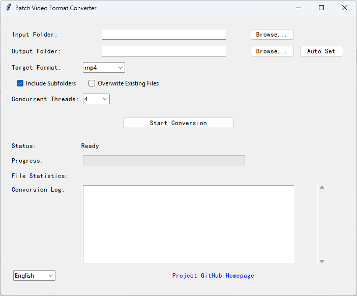

# Batch Video Format Converter
[](https://github.com/Berry-Wahlberg/Free-Media-Conversion/releases)


A user-friendly GUI application for batch converting video files between different formats using FFmpeg.


## Download 
The latest which supports Windows x86 systems. You can download compiled files directly from the official release page: [Free-Media-Conversion Official Releases](https://github.com/Berry-Wahlberg/Free-Media-Conversion/releases)

### Download Instructions
1. Click the official release page link above to navigate to the GitHub Releases page.  
2. Locate your preferred version (we recommend the latest v0.1.1 for optimal functionality) and expand its **Assets** section.  
3. Click the corresponding compiled file (e.g., the Windows x86 zip package for v0.1.1) to initiate the download.  
4. Once the download is complete, extract the contents of the zip file. Run the executable file (usually in `.exe` format) to launch the application.


## Features

- Batch convert video files in bulk
- Support for multiple video formats (MP4, MKV, AVI, MOV, FLV, WMV, etc.)
- Maintain folder structure during conversion
- Recursive scanning of subfolders
- Adjustable number of concurrent conversion threads
- Progress tracking and detailed conversion logs
- Automatic output folder setup
- Support for Chinese and English interfaces

## Requirements

- Python 3.6+
- FFmpeg (must be placed in the `bin` directory as `ffmpeg.exe`)
- Required Python packages:
  - `tkinter` (usually included with Python)
  - `subprocess`
  - `threading`
  - `queue`
  - `time`
  - `concurrent.futures`
  - `webbrowser`
  - `pyinstaller` (for compilation)

## Installation

1. Clone the repository or download the source code
2. Create a `bin` directory in the project root
3. Download the appropriate FFmpeg binary for your system:
   - [FFmpeg Windows Builds](https://ffmpeg.zeranoe.com/builds/)
4. Place `ffmpeg.exe` in the `bin` directory
5. Install required packages:
   ```bash
   pip install pyinstaller
   ```
6. Run the application:
   ```bash
   python main.py
   ```

## Compilation to EXE

To compile the application into a standalone executable, follow these steps:

### 1. Environment Setup

Ensure you have installed all required packages, especially `pyinstaller`:
pip install pyinstaller
### 2. Project Structure Check

Make sure your project structure is correct:
video-converter/
├── main.py
├── bin/
│   └── ffmpeg.exe  # FFmpeg executable
└── ...
### 3. Create a .spec File (Optional)

Generate a .spec file to configure the compilation options:

```
pyinstaller --name "VideoConverter" --onefile --windowed --add-data "bin\*;bin" --add-data "locales\*;locales" main.py
```

This command creates a `VideoConverter.spec` file. You can edit this file to further customize the compilation.

```
pyinstaller --clean VideoConverter.spec
```

Or, you can directly use the following command to compile without creating a .spec file first:
```
pyinstaller --clean --onefile --windowed \
  --hidden-import=tkinter \
  --target-arch=x86_64 \
  --distpath=dist/windows \
  main.py
```
This command creates a `VideoConverter.spec` file. You can edit this file to further customize the compilation.

### 4. Compile Using the .spec File

Run the following command to compile the application using the .spec file:
pyinstaller VideoConverter.spec
### 5. Verify the Compiled Executable

After compilation, the executable file will be located in the `dist` directory. Ensure the `bin` directory is correctly included and the application runs properly.

### 6. Common Issues

- **Missing FFmpeg**: Ensure `ffmpeg.exe` is in the `bin` directory and is included in the compilation.
- **GUI Display Issues**: If the GUI does not display correctly, try adding `--hidden-import tkinter` to the pyinstaller command.
- **Large File Size**: The compiled executable may be large. You can try using UPX compression or creating a virtual environment with only necessary dependencies.

## Usage

1. Launch the application
2. Select the input folder containing the video files
3. Choose the output folder or use the automatic setup
4. Select the target video format (default is MP4)
5. Configure options:
   - Include subfolders for recursive conversion
   - Overwrite existing files in the output folder
   - Set the number of concurrent conversion threads
6. Click "Start Conversion" to begin
7. Monitor the conversion progress and logs

## Screenshot



## Language Switching

The application supports both Chinese and English. To switch languages:
1. Locate the language selection dropdown at the bottom of the interface
2. Select "zh" for Chinese or "en" for English
3. The interface will update to the selected language

## Supported Formats

- Input formats: `.m4s`, `.mp4`, `.mkv`, `.avi`, `.mov`, `.flv`, `.wmv`, `.ts`, `.webm`, `.vob`, `.mts`, `.m2ts`, `.3gp`
- Output formats: `mp4`, `mkv`, `avi`, `mov`, `flv`, `wmv` (more can be added by modifying the code)

## License

This project is open source and available under the [GPL3.0 License](LICENSE).

## Contributing

1. Fork the repository
2. Create a new branch for your feature (`git checkout -b feature/amazing-feature`)
3. Commit your changes (`git commit -m 'Add some amazing feature'`)
4. Push to the branch (`git push origin feature/amazing-feature`)
5. Create a pull request

## Contact

For issues or suggestions, please open an issue on the [GitHub repository](https://github.com/Berry-Wahlberg/video-converter).

## GitHub Repository

[https://github.com/Berry-Wahlberg/video-converter](https://github.com/Berry-Wahlberg/video-converter)
